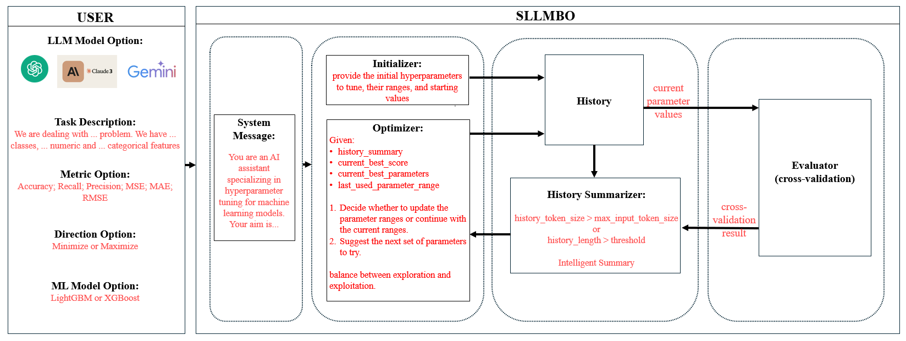

## SLLMBO: Sequential Large Language Model-Based Hyper-Parameter Optimization

Official Code Repository for the paper: `Sequential Large Language Model-Based Hyper-Parameter Optimization`
[[Paper]](https://arxiv.org/abs/2410.20302)

**Author:** Kanan Mahammadli

#### Abstract
This study introduces SLLMBO, an innovative framework that leverages Large Language Models (LLMs) for hyperparameter optimization (HPO), incorporating dynamic search space adaptability, enhanced parameter landscape exploitation, and a hybrid, novel LLM-Tree-structured Parzen Estimator (LLM-TPE) sampler. By addressing limitations in recent fully LLM-based methods and traditional Bayesian Optimization (BO), SLLMBO achieves more robust optimization. This comprehensive benchmarking evaluates multiple LLMs—including GPT-3.5-turbo, GPT-4o, Claude-Sonnet-3.5, and Gemini-1.5-flash—extending prior work beyond GPT-3.5 and GPT-4 and establishing SLLMBO as the first framework to benchmark a diverse set of LLMs for HPO. By integrating LLMs' established strengths in parameter initialization with the exploitation abilities demonstrated in this study, alongside TPE’s exploration capabilities, the LLM-TPE sampler achieves a balanced exploration-exploitation trade-off, reduces API costs, and mitigates premature early stoppings for more effective parameter searches. Across 14 tabular tasks in classification and regression, the LLM-TPE sampler outperformed fully LLM-based methods and achieved superior results over BO methods in 9 tasks. Testing early stopping in budget-constrained scenarios further demonstrated competitive performance, indicating that LLM-based methods generally benefit from extended iterations for optimal results. This work lays the foundation for future research exploring open-source LLMs, reproducibility of LLM results in HPO, and benchmarking SLLMBO on complex datasets, such as image classification, segmentation, and machine translation.


**SLLMBO Workflow**


### Installation
1. Clone the repository:
   ```bash
   git clone git@github.com:KananMahammadli/SLLMBO.git
   ```
2. Download the dataset from the provided link and unzip it under the `src` directory:
   ```bash
   wget -O dataset.zip https://drive.google.com/file/d/1GTtl0J7aqBxOkgw1Rrm7FdDHwddBXDID/view?usp=sharing
   unzip dataset.zip -d src/
   ```
3. Install the required Python packages:
   ```bash
   pip install -r src/requirements.txt
   ```
4. Set up LLM Credentials:
   - Obtain API keys for the LLMs you plan to use (current options: GPT-3.5-turbo, GPT-4, Claude-Sonnet-3.5, Gemini-1.5-flash).
   - replace ... in `src/.env.test` with your API keys.

   ```bash
    OPENAI_API_KEY=...
    GOOGLE_API_KEY=...
    ANTHROPIC_API_KEY=...
    ```
5. Optional Neptune Logging: <br/>
In this study Neptune AI has been used for the experiment tracking. If you want to log your experiments to Neptune, you need to setup environment variable by following the these steps: [Neptune AI API Key Setup](https://docs.neptune.ai/setup/setting_api_token/) and replace project name stored in variable `NEPTUNE_PROJECT_NAME` in `src/configs/config_params.py` with your project name.

### Reproducing Results
The main script to run experiments is `src/run_experiment.py`. Several command-line arguments can be specified to customize the hyperparameter optimization process. Below are explanations of the parameters:

- `--dataset`: Specifies the dataset to be used for the experiment. This parameter accepts predefined dataset names.

  - **Choices**: `gas_drift`, `cover_type`, `adult_census`, `bike_sharing`, `concrete_strength`, `energy`, `m5`
  
  - Example: `--dataset gas_drift`


- `--ml_model`: Determines the machine learning model for which the hyperparameters will be optimized.

  - **Choices**: `lightgbm`, `xgboost`
  
  - Example: `--ml_model lightgbm`

- `--llm`: Specifies the Large Language Model (LLM) to be used during the optimization process.

  - **Choices**: `gpt-3.5-turbo`, `gpt-4o`, `gemini-1.5-flash`, `claude-3-5-sonnet-20240620`
  
  - Example: `--llm gpt-3.5-turbo`


- `--optimization_method`: Chooses the optimization method to be used.

  - **Choices**: `sllmbo`, `optuna`, `hyperopt`
  
  - Example: `--optimization_method sllmbo`


- `--sllmbo_method`: If the SLLMBO optimization method is chosen, this parameter further specifies which SLLMBO strategy to use.

  - **Choices**: `sllmbo_fully_llm_with_intelligent_summary`, `sllmbo_fully_llm_with_langchain`, `sllmbo_llm_tpe`
  
  - Example: `--sllmbo_method sllmbo_llm_tpe`


- `--llm_tpe_init_method`: For the LLM-TPE Sampler, this parameter specifies the initialization for the first trial.

  - **Choices**: `llm`, `random`
  
  - Example: `--llm_tpe_init_method llm`

- `--patience`: If the `optimization_method` is `Optuna` or `SLLMBO` with `LLm-TPE Sampler`, `patience` can be used for early stopping, i.e. the number of iterations without improvement in optimization metrics before the optimization process is prematurely stopped.

  - Example: `--patience 5`

- `--log_to_neptune`: A boolean flag that, when set, logs the experiment details and results to Neptune.

  - Usage: `--log_to_neptune`
  
- `--verbose`: A boolean flag that, when set, enables the printing of optimization results directly to the console.

  - Usage: `--verbose`

#### Examples

1. **SLLMBO Optimization**

   - Fully LLM with Intelligent Summary:
     ```bash
     python src/run_experiment.py --dataset gas_drift --ml_model lightgbm --optimization_method sllmbo --sllmbo_method sllmbo_fully_llm_with_intelligent_summary
     ```
   - Fully LLM with Langchain:
     ```bash
     python src/run_experiment.py --dataset gas_drift --ml_model lightgbm --llm gpt-3.5-turbo --optimization_method sllmbo --sllmbo_method sllmbo_fully_llm_with_langchain
     ```
   - LLM-TPE Sampler without patiance:
     ```bash
     python src/run_experiment.py --dataset gas_drift --ml_model lightgbm --llm gpt-3.5-turbo --optimization_method sllmbo --sllmbo_method sllmbo_llm_tpe --llm_tpe_init_method llm
     ```
    - LLM-TPE Sampler with patiance:
        ```bash
        python src/run_experiment.py --dataset gas_drift --ml_model lightgbm --llm gpt-3.5-turbo --optimization_method sllmbo --sllmbo_method sllmbo_llm_tpe --llm_tpe_init_method llm --patience 5
        ```

    For `Fully LLM with Langchain` and `LLM-TPE Sampler` methods, any allowed LLM can be used by specifying the `--llm` flag.


2. **Optuna Optimization**

   - Without patience:
     ```bash
     python src/run_experiment.py --dataset gas_drift --ml_model lightgbm --optimization_method optuna
     ```
   - With patience:
     ```bash
     python src/run_experiment.py --dataset gas_drift --ml_model lightgbm --optimization_method optuna --patience 5
     ```

2. **Hyperopt Optimization**
   ```bash
   python src/run_experiment.py --dataset gas_drift --ml_model lightgbm --optimization_method hyperopt
   ```

For all methods above, any allowed dataset and ml_model can be used by specifying the `--dataset` and `--ml_model` flags to reproduce the specific experiment.


### Running SLLMBO for Custom Hyperparameter Optimization Tasks

To run SLLMBO-based HPO with all possible strategies for your custom datasets, (e.g. `new_dataset`), follow these steps:

1. Add your dataset_name: `new_dataset` to `DATASET_NAMES` under `src/configs/config_enum.py`

2. Add your problem description to `PROBLEM_DESCRIPTIONS` under `src/configs/config_problem_descriptions.py`

3. Create metadata for `new_dataset` (define metric, cross-validation method, etc.) in `src/configs/datasets` folder by creating `new_dataset.py` file. And store metadata in `NEW_DATASET_METADATA`. For classsification tasks, you can use `src\configs\datasets\gas_drift.py` as a template, and for regression tasks, you can use `src\configs\datasets\concrete_strength.py` as a template.

4. Add your `NEW_DATASET_METADATA` to `TASKS_METADATA` under `src/configs/config_tasks.py` with corresponding dataset name: `new_dataset`

After completing these steps, you can run the SLLMBO as given in the previous section by specifying the `--dataset` flag as `new_dataset`.

#### Using only LLM-TPE Sampler
If you want to use only LLM-TPE Sampler as an alternative Sampler to Optuna Samplers, you can use the standalone script `src\optimizers\optuna_sampler.py`. This script has LLM Sampler and LLM-TPE Sampler. Below is an example of how to use the LLM-TPE Sampler in Optuna:
```python
from src.optimizers.optuna_sampler import LLMSampler, LLM_TPE_SAMPLER
import optuna

llm_sampler = LLMSampler(
    llm_name="gpt-3.5-turbo",
    model_name="lightgbm",
    metric="f1-weighted",
    direction="maximize",
    problem_description=problem_description,
    search_space_dict=param_space,
)

llm_tpe_sampler = LLM_TPE_SAMPLER(
    llm_sampler,
    seed=42,
    init_method="llm",
)

study = optuna.create_study(
    study_name=study_name,
    storage=storage,
    direction="maximize",
    load_if_exists=True,
    sampler=llm_tpe_sampler,
)
study.optimize(
    objective,
    n_trials=n_trials,
)
```

### Defining New Metrics
In this study, `f1-score` has been used for the classification tasks, and `neg_mean_absolute_error` has been used for the regression tasks for consistency. However, you can use any scikit-learn compatible metric (refer to [SKLearn Metrics](https://scikit-learn.org/1.5/modules/model_evaluation.html#common-cases-predefined-values)) by adding the string name of the metric to `METRICS` in `src/configs/config_enum.py`. You also need to define metric name and metric function in corresponding dataset's metadata in `src/configs/datasets` folder.

### Defining New Machine Learning Models
In this study, `LightGBM` and `XGBoost` models have been used. However, you can use any scikit-learn compatible model by adding the string name of the model to `ML_MODEL_NAMES` in `src/configs/config_enum.py`. You also need to provide corresponding `classification` and `regression` classes for the model in `ESTIMATORS_DICT` under `src/configs/config_dicts.py`. Ex: for `LightGBM`, classification tasks use `LGBMClassifier` and regression tasks use `LGBMRegressor`. With this setup, you can use `SLLMBO Fully LLM with Intelligent Summary` and `SLLMBO Fully LLM with Langchain`. To use `LLM-TPE` sampler, you need to define search space for the model in `get_param_space` function in `src\optimizers\util.py` too. To run any `SLLMBO` method with new ML model, you need to pass the model name defined in `ML_MODEL_NAMES` to `--ml_model` flag.

### Citation

If you find this study useful for your research or if you use any part of this code in your work, please consider citing the paper as:
```
@article{
  Mahammadli2024,
  title={Sequential Large Language Model-Based Hyper-Parameter Optimization},
  author={Kanan Mahammadli},
  journal={arXiv},
  year={2024},
  url={https://arxiv.org/abs/2410.20302}
}
```